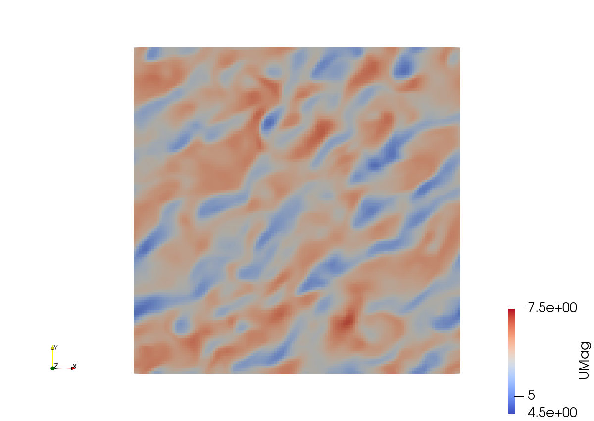
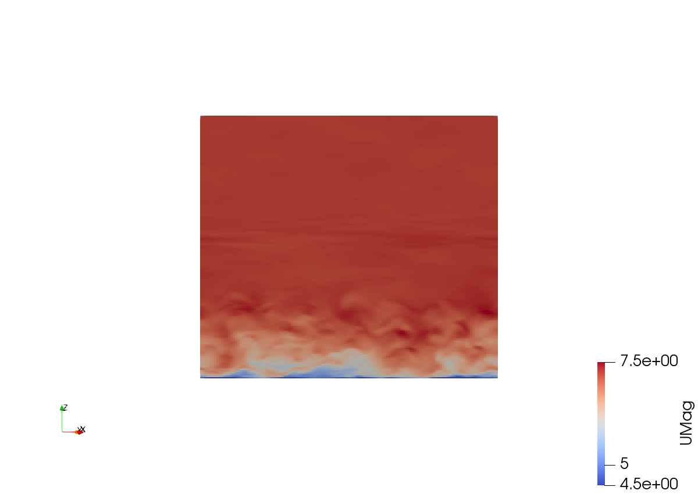
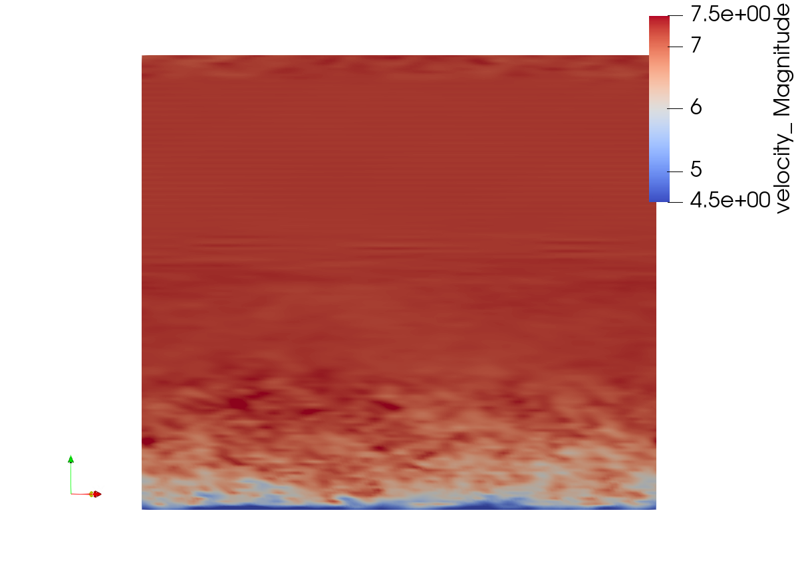

# AMR-wind vs Nalu-wind comparison 6

Top of log file:
```
nodes = 16
cores = 16
ncpus = 256
==============================================================================
                AMR-Wind (https://github.com/exawind/amr-wind)

  AMR-Wind Git SHA :: a834a0612cb8
  AMReX version    :: 20.05-42-g0c4606cf624a ( 20.05-42-g0c4606cf624a )

  Exec. date       :: Thu May 21 12:46:37 2020
  Build date       :: May 15 2020 11:22:32
  C++ compiler     :: Intel 19.0.5.20190815

  MPI              :: ON    (Num. ranks = 256)
  GPU              :: OFF
  OpenMP           :: OFF

           This software is released under the BSD 3-clause license.           
 See https://github.com/Exawind/amr-wind/blob/development/LICENSE for details. 
------------------------------------------------------------------------------

MPI initialized with 256 MPI processes
MPI initialized with thread support level 0
AMReX (20.05-42-g0c4606cf624a) initialized
Initializing AMR-Wind ...
```

Get the line_plot.txt file at: 

## Comparison plots
**AMR-wind Hub-height velocity slice**  
  
**Nalu-wind Hub-height velocity slice**  
  

**AMR-wind streamwise velocity slice**  
  
**Nalu-wind streamwise velocity slice**  


**AMR-wind streamwise temperature slice**  
  
**Nalu-wind streamwise temperature slice**  

